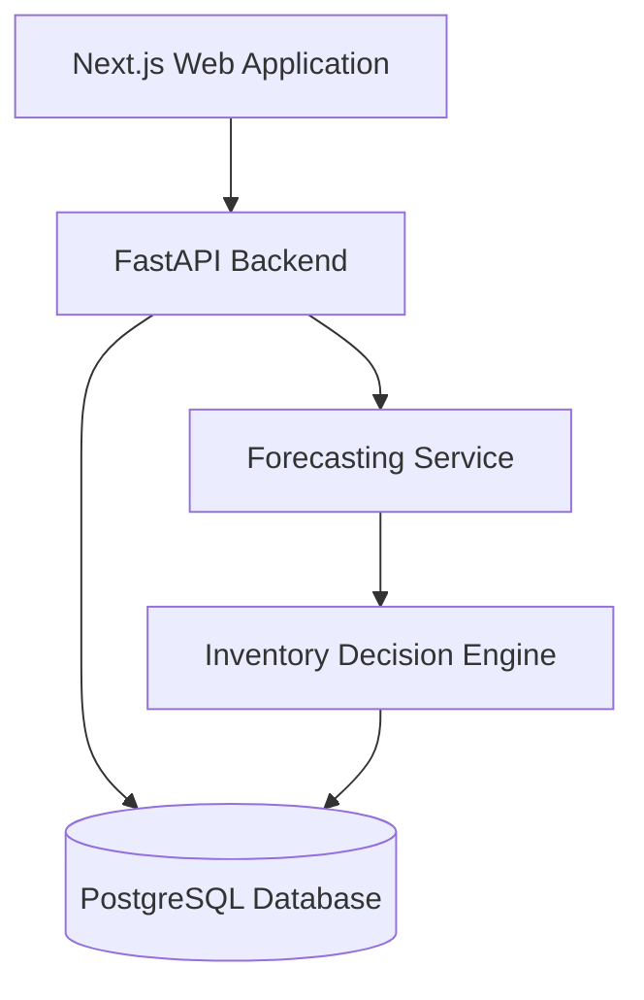

# RetailPulse AI — Product Requirements Document

> An AI-powered demand forecasting and inventory decision platform for Malaysian SMEs.
>
> **Status:** Draft v1.0 — planning and dataset selection phase.
> **Sources:** `docs/RetailPulse_AI_Technical_Workflow.md`, `docs/retailpulse_project.md`.

---

## 1. Problem Statement

Small and medium-sized retailers in Malaysia often make inventory decisions using manual calculations, spreadsheets, or personal judgement. This leads to:

- Stockouts when customers need products.
- Excess inventory that increases holding costs.
- Poor preparation for seasonal demand and promotions.
- Late detection of changing sales patterns.
- Weak linkage between demand forecasts and purchasing decisions.

RetailPulse AI addresses this by converting sales and inventory data into forecasts, stockout-risk alerts, and reorder recommendations that a store manager can act on.

## 2. Product Vision

A web platform where a retail manager uploads historical sales data and receives:

- Short-term demand forecasts per product.
- Stockout and overstock risk detection.
- Reorder point, safety stock, and recommended order quantity.
- Explanations of why demand is expected to change.
- An optional promotion simulator that recalculates demand and risk.

The platform turns prediction into **prescriptive** inventory decisions, not just dashboards.

## 3. Target Users and Roles

**Primary user (MVP):** A store manager responsible for monitoring inventory and deciding what to reorder.

**MVP role:** `store_manager` — full access to their own store's data, forecasts, and recommendations.

**Post-MVP roles:** `admin` (manages users and stores), `staff` (read-only access).

## 4. Goals and Objectives

### Main Objective
Develop and evaluate a full-stack retail intelligence platform that uses machine learning to support demand forecasting and inventory replenishment decisions.

### Specific Objectives
1. Prepare and analyse historical retail sales, product, price, promotion, and calendar data.
2. Develop and compare baseline and machine-learning models for short-term product demand forecasting.
3. Design an inventory decision engine that calculates stockout risk, reorder points, safety stock, and recommended order quantities.
4. Develop a web-based system that presents forecasts and inventory recommendations through an accessible dashboard.
5. Evaluate the platform using forecasting, business, and software performance metrics.

## 5. Scope

### In Scope — MVP
- User registration, login, and session management.
- Role-based access (single role for MVP: `store_manager`).
- Product and inventory management (create, edit, view).
- CSV sales-data upload with validation and clear error reporting.
- Sales overview dashboard.
- Product-level demand forecasting (7-day and 28-day horizons).
- Low-stock and stockout-risk detection.
- Reorder recommendations (quantity, reorder point, safety stock, estimated stockout date).
- Forecast-performance dashboard.
- Exportable recommendation report (CSV).

### Out of Scope — MVP
- Promotion scenario simulator (Phase 2).
- Email or in-app alerts (Phase 2).
- SHAP explanations (Phase 2).
- Multiple stores and suppliers (Phase 2).
- Customer-review sentiment as demand signal (Phase 2).
- Model drift monitoring (Phase 2).
- AI-generated management summaries (Phase 2).
- Kafka, Kubernetes, microservices, deep-learning forecasting (LSTM/Transformers), Redis, generative AI chatbots.

These will be considered only if the working MVP demonstrates a genuine need.

## 6. Initial Forecasting Scope (MVP)

- One store.
- One product category.
- Approximately 50 to 100 products.
- Daily sales data.
- 28-day forecast horizon (7-day also supported).

The scope can be expanded to additional stores and categories after the MVP works correctly.

## 7. User Stories

### Authentication and Access
- As a store manager, I can register and log in so that my data is protected.
- As a store manager, I can log out and end my session.
- As a store manager, I can view my profile.
- As a store manager, I can only access data for my own store.

### Data Management
- As a store manager, I can upload a sales CSV file.
- As a store manager, I receive clear, row-level validation errors when my file is invalid.
- As a store manager, I can view my upload history.
- As a store manager, I can create, edit, and view products.
- As a store manager, I can update inventory (current stock, lead time, minimum order quantity).

### Forecasting
- As a store manager, I can generate a 7-day or 28-day forecast.
- As a store manager, I can compare historical and predicted demand.
- As a store manager, I can view forecast uncertainty (range) when available.
- As a store manager, I can view model performance versus actual sales.

### Inventory
- As a store manager, I can see which products are at high, medium, or low stockout risk.
- As a store manager, I can view the recommended reorder quantity per product.
- As a store manager, I can view the estimated stockout date per product.
- As a store manager, I can export the recommendations as a CSV.

## 8. Functional Requirements

### FR-1 User Management
| ID | Requirement |
|---|---|
| FR-1.1 | The system shall allow a user to register with email and password. |
| FR-1.2 | The system shall authenticate users via Supabase Auth. |
| FR-1.3 | The system shall enforce role-based access; a user may only access their own store's records. |
| FR-1.4 | The system shall support logout and session expiry. |

### FR-2 Data Management
| ID | Requirement |
|---|---|
| FR-2.1 | The system shall accept CSV upload of historical sales data. |
| FR-2.2 | The system shall validate CSV structure using a Pandera schema. |
| FR-2.3 | The system shall reject empty files, non-CSV files, and oversized files. |
| FR-2.4 | The system shall report row-, column-, and rule-level errors. |
| FR-2.5 | The system shall store upload history. |
| FR-2.6 | The system shall allow product CRUD operations. |
| FR-2.7 | The system shall allow inventory updates (current_stock, lead_time_days, minimum_order_quantity). |

### FR-3 Forecasting
| ID | Requirement |
|---|---|
| FR-3.1 | The system shall generate a 7-day or 28-day demand forecast per product. |
| FR-3.2 | The system shall use leakage-safe lag and rolling features. |
| FR-3.3 | The system shall clip negative predictions to zero. |
| FR-3.4 | The system shall store forecasts and model versions in the database. |
| FR-3.5 | The system shall expose forecast results via API and dashboard. |

### FR-4 Inventory Decision Engine
| ID | Requirement |
|---|---|
| FR-4.1 | The system shall calculate predicted demand during the supplier lead time. |
| FR-4.2 | The system shall calculate safety stock for a 95% service level. |
| FR-4.3 | The system shall calculate the reorder point. |
| FR-4.4 | The system shall classify stockout risk as low, medium, or high. |
| FR-4.5 | The system shall calculate recommended reorder quantity, adjusted to minimum order quantity. |
| FR-4.6 | The system shall estimate the stockout date. |
| FR-4.7 | The system shall expose recommendations via API and dashboard. |
| FR-4.8 | The system shall allow CSV export of recommendations. |

### FR-5 Model and Performance Visibility
| ID | Requirement |
|---|---|
| FR-5.1 | The system shall record model parameters, metrics, and versions in MLflow. |
| FR-5.2 | The system shall expose model performance (WMAPE, MAE, RMSE, bias) via API and dashboard. |

## 9. Non-Functional Requirements

| Category | Requirement |
|---|---|
| Performance | Normal API requests shall respond in under 2 seconds. Model training is a separate long-running process. |
| Security | Unauthenticated users cannot access protected endpoints. Users cannot access another store's records. Passwords are not stored by the application. SQL queries are parameterised. Secrets are stored in environment variables. `.env` and credentials are excluded from version control. |
| Validation | Upload file types and sizes are restricted. Row-level validation errors are returned where possible. |
| Usability | At least 80% task-completion rate in user testing; SUS ≥ 68; no critical task that most users consistently fail. |
| Reliability | Forecast pipeline must be deterministic for a fixed dataset and model version. |
| Maintainability | Feature engineering is a single reusable function shared by notebook and backend to prevent training-serving mismatch. |
| Accessibility | Frontend must meet basic accessibility standards (semantic HTML, keyboard-navigable, sufficient contrast). |
| Deployment | The system shall run consistently via Docker Compose and deploy to Vercel (frontend), Render (backend), and Supabase (database). |
| Responsiveness | The dashboard must work on desktop and mobile. |

## 10. Data Model and Validation

### Primary Dataset
The MVP uses the [M5 Forecasting Accuracy dataset](https://www.kaggle.com/competitions/m5-forecasting-accuracy):
- Daily product sales
- Product identifiers and categories
- Store identifiers
- Product prices
- Calendar events
- Promotion-related indicators

### Target Modelling Format (long)
| date | store_id | product_id | category | sales | price | event | promotion |
|---|---|---|---|---:|---:|---|---:|
| 2025-01-01 | S001 | P001 | Foods | 18 | 12.90 | Holiday | 1 |

### Malaysian Localisation
Clearly labelled simulated information may be added:
- Prices in RM
- Malaysian supplier names and lead times
- Hari Raya, Chinese New Year, Deepavali, and school-holiday indicators
- Local promotion periods

Synthetic data must not be presented as genuine business data.

### Pandera Column Validation
| Column | Rule |
|---|---|
| `date` | Valid date |
| `product_id` | Required, non-empty |
| `store_id` | Required, non-empty |
| `sales` | Integer ≥ 0 |
| `price` | Numeric > 0 |
| `current_stock` | Integer ≥ 0 |
| `lead_time_days` | Integer 1–90 |
| `promotion` | Only 0 or 1 |

### Dataset-Level Validation
- Required columns present.
- File is CSV and not empty.
- File size within the permitted limit.
- `date + store_id + product_id` combinations are unique.
- No negative sales or inventory values.
- No future dates in historical sales.
- Missing prices identified and handled consistently.
- Invalid records returned with understandable error messages (e.g., `Row 27: sales contains a negative value.`).

## 11. Forecasting Methodology

### Baselines
- **Seasonal naive** (main baseline): `forecast_today = sales_7_days_ago`.
- Optional 28-day moving average baseline.

### ML Models
| Model | Purpose |
|---|---|
| Seasonal naive | Main baseline |
| Linear regression | Simple interpretable comparison |
| LightGBM | Main machine-learning model |

Deep learning (LSTM, Transformers) is excluded from the MVP.

### Features
Historical demand: `sales_lag_1`, `sales_lag_7`, `sales_lag_14`, `sales_lag_28`, `rolling_mean_7`, `rolling_mean_14`, `rolling_mean_28`, `rolling_std_28`.

Rolling features must use shifted sales to prevent leakage:
```python
df["rolling_mean_7"] = (
    df.groupby(["store_id", "product_id"])["sales"]
      .transform(lambda v: v.shift(1).rolling(7).mean())
)
```

Calendar: day of week, week of year, month, weekend indicator, holiday indicator, event type.
Commercial: current price, previous price, price-change percentage, promotion indicator, promotion days in previous month.

Provided by a single reusable `create_forecasting_features(df)` function shared by notebook and backend.

### Negative Predictions
```python
predictions = np.maximum(predictions, 0)
```

## 12. Validation Strategy

### Time-Based Holdout
| Dataset | Period |
|---|---|
| Training | All dates except final 56 days |
| Validation | Days −56 to −29 |
| Test | Final 28 days |

The test set remains untouched until the model and hyperparameters are finalised.

### Rolling-Origin Validation
Three expanding-window folds of 28 days each. Random train-test splitting is forbidden for forecasting.

## 13. Evaluation Metrics

### Forecasting
- **Primary:** WMAPE
- **Secondary:** MAE, RMSE, forecast bias, RMSSE (optional, M5-relevant)

### Model Selection Rules
The final model must:
- Beat the seasonal baseline on test-set WMAPE.
- Perform consistently across rolling folds.
- Avoid extreme forecast bias.
- Perform reasonably for high- and low-demand products.
- Produce stable predictions with no negative demand values.

The simplest model that satisfies these conditions is selected.

### Business Evaluation (Inventory Policy Simulation)
Compare baseline policy (fixed-quantity reorder at a fixed threshold) vs. forecast-based policy (lead-time demand, safety stock, reorder points, recommended quantities).

Both policies use the same starting inventory, actual test-period demand, supplier lead time, delivery assumptions, and product/ordering costs.

| Metric | Meaning |
|---|---|
| Stockout rate | % of days with insufficient inventory |
| Fill rate | % of customer demand fulfilled |
| Lost sales | Demand that could not be fulfilled |
| Average inventory | Average units held |
| Holding cost | Cost of carrying inventory |
| Number of orders | Replenishment frequency |
| Emergency reorders | Unexpected urgent purchases |
| Total inventory cost | Holding + ordering + stockout costs |

Success: reduced stockouts or total cost without unreasonable excess inventory.

### Software Evaluation
- API response time
- Automated test coverage
- Invalid-file handling
- Authentication and authorisation
- Mobile responsiveness
- Usability (SUS)

## 14. Inventory Decision Engine (Calculations)

### Safety Stock (95% service level)
$$ \text{Safety Stock} = 1.645 \times \sigma_{\text{lead-time demand}} $$

### Reorder Point
$$ \text{Reorder Point} = \text{Expected Lead-Time Demand} + \text{Safety Stock} $$

### Stockout Risk
| Condition | Risk |
|---|---|
| Current stock ≤ predicted lead-time demand | High |
| Current stock ≤ reorder point | Medium |
| Current stock > reorder point | Low |

### Recommended Reorder Quantity
$$ \text{Recommended Quantity} = \max(0, \text{Target Stock} - \text{Current Stock} - \text{On-Order Stock}) $$
Then adjusted to the product's minimum order quantity.

### Required Functions
- `calculate_lead_time_demand()`
- `calculate_safety_stock()`
- `calculate_reorder_point()`
- `classify_stockout_risk()`
- `calculate_reorder_quantity()`
- `estimate_stockout_date()`

## 15. Backend API

| Method | Endpoint | Function |
|---|---|---|
| `POST` | `/sales/upload` | Upload and validate sales data |
| `GET` | `/sales/summary` | Retrieve sales summary |
| `GET` | `/products` | List products |
| `POST` | `/products` | Create a product |
| `PUT` | `/inventory/{product_id}` | Update inventory |
| `POST` | `/forecasts/generate` | Generate forecasts |
| `GET` | `/forecasts/{product_id}` | Retrieve a product forecast |
| `GET` | `/model/performance` | Retrieve model evaluation results |
| `POST` | `/recommendations/generate` | Generate inventory recommendations |
| `GET` | `/recommendations` | Retrieve recommendations |
| `GET` | `/alerts` | Retrieve high-risk products |

All API inputs and outputs are validated by Pydantic schemas.

## 16. Database Schema (Proposed Tables)

| Table | Purpose |
|---|---|
| `users` | User accounts and roles |
| `stores` | Retail outlet information |
| `products` | Product details |
| `sales` | Historical product sales |
| `inventory` | Stock quantity and supplier lead time |
| `forecasts` | Predicted product demand |
| `reorder_recommendations` | Inventory recommendations and risk levels |
| `model_runs` | Model version, parameters, and evaluation results |

## 17. Frontend Pages

1. Login and registration
2. Overview dashboard
3. Product management
4. Inventory management
5. Sales-data upload
6. Demand forecast
7. Inventory risk dashboard
8. Reorder recommendations
9. Model performance
10. User and system settings

## 18. Technology Stack

| Area | Technology | Function |
|---|---|---|
| Development | VS Code | Main editor |
| Version control | Git and GitHub | Code, versions, portfolio |
| Data exploration | Jupyter Notebook | EDA and experiments |
| Programming | Python | Data processing, ML, backend |
| Data processing | Pandas, NumPy | Clean, transform, analyse |
| Data validation | Pandera | Validate datasets |
| Machine learning | scikit-learn, LightGBM | Baselines and forecasts |
| Explainability | SHAP (post-MVP) | Explain predictions |
| Model tracking | MLflow | Parameters, metrics, versions |
| Backend | FastAPI | APIs |
| API validation | Pydantic | Validate API I/O |
| Database | PostgreSQL | Persist all data |
| DB management | DBeaver | Query and manage PostgreSQL |
| Frontend | Next.js, TypeScript | Web application |
| Styling | Tailwind CSS | Responsive UI |
| Charts | Recharts | Sales, forecasts, risks |
| Auth | Supabase Auth | Registration, login, sessions |
| API testing | Postman or Bruno | Backend endpoints |
| Backend testing | Pytest | Python functions and APIs |
| Frontend testing | Vitest, Playwright | Components and E2E |
| Containerisation | Docker, Docker Compose | Consistent local runs |
| Automation | GitHub Actions | CI tests |
| Deployment | Vercel, Render, Supabase | Frontend, backend, database |

## 19. System Architecture



## 20. Repository Structure

```text
retailpulse-ai/
├── backend/
│   ├── app/
│   │   ├── api/
│   │   ├── database/
│   │   ├── models/
│   │   ├── schemas/
│   │   ├── services/
│   │   └── main.py
│   ├── tests/
│   └── requirements.txt
├── frontend/
│   ├── src/
│   └── tests/
├── data/
│   ├── raw/
│   ├── processed/
│   └── sample/
├── docs/
├── models/
├── notebooks/
├── scripts/
├── .github/
│   └── workflows/
├── .gitignore
├── docker-compose.yml
├── LICENSE
└── README.md
```

Large raw datasets are not committed to GitHub. Include a small sample and download instructions.

## 21. Testing Strategy

### Unit Tests (Pytest)
- Feature engineering
- WMAPE calculation
- Safety stock, reorder point, risk classification, reorder quantity
- CSV schema validation

```python
def test_reorder_point_is_demand_plus_safety_stock():
    assert calculate_reorder_point(100, 20) == 120
```

### Integration Tests
- CSV upload → validation → database
- Database → model → forecast storage
- Forecast → inventory engine → recommendation
- Backend API → frontend dashboard

### End-to-End Tests (Playwright)
1. User logs in.
2. User uploads a sales file.
3. System validates the file.
4. User generates a forecast.
5. Dashboard displays the result.
6. User reviews recommendations.
7. User exports the recommendations.

### Security Validation
- Unauthenticated users cannot access protected pages.
- Users cannot access another store's records.
- Upload file types and sizes are restricted.
- Passwords are not stored directly.
- SQL queries are parameterised.
- Secrets are in environment variables.
- `.env` and credentials excluded from GitHub.

### Performance Validation
- CSV processing time
- Forecast generation time
- Dashboard loading time
- API response time
- Database query time

### User Validation
Approximately five users complete:
1. Upload a sales file.
2. Find the highest-risk product.
3. View its 28-day forecast.
4. Identify the recommended order quantity.
5. Export the recommendations.

Measure: task completion rate, time per task, number of errors, comments, SUS.

## 22. Implementation Order

- [ ] Create the GitHub repository and folder structure.
- [ ] Download the M5 dataset.
- [ ] Select one store, one category, and 50–100 products.
- [ ] Create the Pandera data schema.
- [ ] Complete the EDA notebook (`notebooks/01_m5_exploratory_data_analysis.ipynb`).
- [ ] Convert the selected data into long format.
- [ ] Create lag, rolling, calendar, price, and promotion features.
- [ ] Build the seasonal naive baseline.
- [ ] Record baseline WMAPE, MAE, RMSE, and bias.
- [ ] Train and validate the LightGBM model.
- [ ] Compare all models using the untouched test period.
- [ ] Build and test the inventory calculation functions.
- [ ] Run the inventory-policy simulation.
- [ ] Design the PostgreSQL database and FastAPI endpoints.
- [ ] Develop the Next.js interface.
- [ ] Integrate the forecasting and inventory services.
- [ ] Add unit, integration, and end-to-end tests.
- [ ] Configure GitHub Actions.
- [ ] Deploy the complete application.
- [ ] Conduct user validation.
- [ ] Prepare project documentation and a demonstration video.

## 23. Milestones

### Milestone 1 (First Deliverable)
A validated modelling dataset, completed exploratory analysis, and a seasonal naive 28-day demand forecast with recorded WMAPE, MAE, RMSE, and bias.

The web application is built only after this forecasting foundation works correctly.

### Milestone 2
LightGBM model beating the seasonal baseline on test-set WMAPE, with rolling-origin validation and MLflow-tracked runs.

### Milestone 3
Inventory decision engine passing unit tests and the inventory-policy simulation showing a benefit over the fixed-threshold baseline.

### Milestone 4
MVP backend and frontend deployed, end-to-end tests passing, user validation complete.

## 24. Success Criteria

A high forecasting score alone does not prove the system is useful. The MVP is considered successful when all of the following are true:

| Area | Criterion |
|---|---|
| Data validation | Input data is complete, valid, and consistent per the Pandera schema. |
| Model validation | Forecast generalises to unseen dates via time-based holdout and rolling validation. |
| Model evaluation | Selected model beats the seasonal baseline on test-set WMAPE. |
| Business evaluation | Forecast-based policy reduces stockouts or total inventory cost without unreasonable excess inventory. |
| Software testing | Unit, integration, and E2E tests pass; ≥ 80% task completion in user tests; SUS ≥ 68. |
| Security | All security validation checks pass. |
| Performance | API responses under 2 seconds; dashboard loads promptly. |
| Deployment | Application deployed and runnable via Docker Compose. |

## 25. Risks and Assumptions

- The M5 dataset is used for development; Malaysian localisation is simulated and clearly labelled.
- Inventory, supplier lead times, and minimum order quantities are initially simulated.
- Model training is treated as a separate long-running process, not a request-time operation.
- Random train-test splitting is forbidden to avoid future leakage.
- Synthetic Malaysian sales data is never presented as real.

## 26. Open Questions

- [ ] Finalise whether forecast horizon default is 7 or 28 days in the first UI.
- [ ] Confirm whether SHAP explanations ship in MVP or Phase 2 (currently Phase 2).
- [ ] Confirm hosting providers and accounts (Vercel, Render, Supabase).
- [ ] Decide whether the EDA notebook lives in `notebooks/` only or is also mirrored as scripts.

## 27. Current Status

**Stage:** Planning and technical design.
**Next task:** Create the repository, download the M5 dataset, and select the initial modelling scope (one store, one category, 50–100 products).