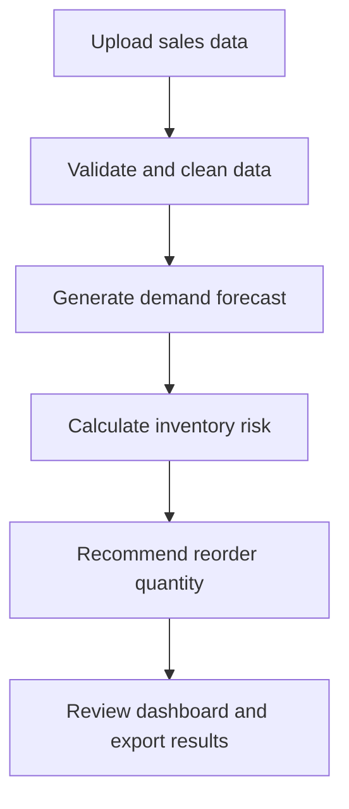

# RetailPulse AI: Technical Workflow

## Demand Forecasting and Inventory Decision Platform

This document describes the recommended development workflow, software stack, system functions, validation methods, and evaluation plan for **RetailPulse AI**.

RetailPulse AI is a full-stack retail intelligence platform that uses historical sales data to forecast product demand, identify stockout risks, and recommend inventory reorder quantities.

---

## Table of Contents

1. [Technology Stack](#1-technology-stack)
2. [System Workflow](#2-system-workflow)
3. [Project Setup](#3-project-setup)
4. [Data Preparation](#4-data-preparation)
5. [Data Validation](#5-data-validation)
6. [Exploratory Data Analysis](#6-exploratory-data-analysis)
7. [Feature Engineering](#7-feature-engineering)
8. [Model Development](#8-model-development)
9. [Forecast Validation](#9-forecast-validation)
10. [Forecast Evaluation](#10-forecast-evaluation)
11. [Inventory Decision Engine](#11-inventory-decision-engine)
12. [System Functions](#12-system-functions)
13. [Backend API](#13-backend-api)
14. [Inventory Policy Evaluation](#14-inventory-policy-evaluation)
15. [Software Testing](#15-software-testing)
16. [User Validation](#16-user-validation)
17. [Final Evaluation Framework](#17-final-evaluation-framework)
18. [Implementation Order](#18-implementation-order)

---

## 1. Technology Stack

| Area | Software or Technology | Function |
|---|---|---|
| Development | VS Code | Main code editor |
| Version control | Git and GitHub | Store code, manage versions, and present the project |
| Data exploration | Jupyter Notebook | Exploratory analysis and model experiments |
| Programming | Python | Data processing, machine learning, and backend development |
| Data processing | Pandas and NumPy | Clean, transform, and analyse data |
| Data validation | Pandera | Validate uploaded and processed datasets |
| Machine learning | scikit-learn and LightGBM | Create baselines and demand forecasts |
| Explainability | SHAP | Explain the factors influencing predictions |
| Model tracking | MLflow | Record model parameters, metrics, and versions |
| Backend | FastAPI | Provide APIs to the web application |
| API validation | Pydantic | Validate API requests and responses |
| Database | PostgreSQL | Store users, products, sales, inventory, and predictions |
| Database management | DBeaver | View, query, and manage PostgreSQL |
| Frontend | Next.js and TypeScript | Build the web application |
| Styling | Tailwind CSS | Design responsive pages and components |
| Charts | Recharts | Display sales, forecasts, and inventory risks |
| Authentication | Supabase Auth | Manage registration, login, and sessions |
| API testing | Postman or Bruno | Test backend endpoints |
| Backend testing | Pytest | Test Python functions and APIs |
| Frontend testing | Vitest and Playwright | Test components and complete user workflows |
| Containerisation | Docker and Docker Compose | Run the system consistently |
| Automation | GitHub Actions | Run tests automatically on GitHub |
| Deployment | Vercel, Render, and Supabase | Deploy the frontend, backend, and database |

### Technologies Excluded from the MVP

The first version will not require:

- Kafka
- Kubernetes
- Microservices
- Deep-learning forecasting
- Redis or distributed task queues
- Generative AI chatbots

These may be considered only if the working system later demonstrates a genuine need for them.

---

## 2. System Workflow

### Target User

The initial target user is a store manager responsible for monitoring inventory and deciding which products should be reordered.

### Main User Workflow



### Initial Forecasting Scope

- One store
- One product category
- Approximately 50 to 100 products
- Daily sales data
- A 28-day forecast horizon

The scope can be expanded to additional stores and categories after the MVP works correctly.

---

## 3. Project Setup

### Recommended Repository Structure

```text
retailpulse-ai/
├── backend/
│   ├── app/
│   │   ├── api/
│   │   ├── database/
│   │   ├── models/
│   │   ├── schemas/
│   │   ├── services/
│   │   └── main.py
│   ├── tests/
│   └── requirements.txt
├── frontend/
│   ├── src/
│   └── tests/
├── data/
│   ├── raw/
│   ├── processed/
│   └── sample/
├── docs/
├── models/
├── notebooks/
├── scripts/
├── .github/
│   └── workflows/
├── .gitignore
├── docker-compose.yml
├── LICENSE
└── README.md
```

### Initial Setup Steps

1. Install VS Code.
2. Install Python.
3. Install the current Node.js LTS release.
4. Install Git and Docker Desktop.
5. Create the GitHub repository.
6. Create a Python virtual environment.
7. Create the Next.js frontend.
8. Configure PostgreSQL using Docker Compose.
9. Create `.env.example` files for required environment variables.
10. Confirm that secrets and raw datasets are excluded through `.gitignore`.

Large raw datasets must not be committed to GitHub. The repository should include a small sample dataset and instructions for downloading the complete dataset.

---

## 4. Data Preparation

### Primary Dataset

The initial implementation will use the [M5 Forecasting Accuracy dataset](https://www.kaggle.com/competitions/m5-forecasting-accuracy).

Relevant data includes:

- Daily product sales
- Product identifiers and categories
- Store identifiers
- Product prices
- Calendar events
- Promotion-related indicators

### Target Modelling Format

The original wide sales table should be converted into long format:

| date | store_id | product_id | category | sales | price | event | promotion |
|---|---|---|---|---:|---:|---|---:|
| 2025-01-01 | S001 | P001 | Foods | 18 | 12.90 | Holiday | 1 |

### Data Pipeline Functions

```python
def load_m5_data():
    """Load the required M5 dataset files."""


def select_project_scope():
    """Select the initial store, category, products, and date range."""


def reshape_sales_to_long_format():
    """Convert daily sales columns into product-date rows."""


def merge_calendar_and_prices():
    """Add calendar, price, event, and promotion information."""


def validate_sales_data():
    """Validate the structure and values of the prepared dataset."""


def create_modelling_dataset():
    """Create and save the final modelling table."""
```

Each function should perform one clear responsibility and should be reusable outside the notebook.

---

## 5. Data Validation

Use **Pandera** to define and enforce the expected data schema.

### Column Validation Rules

| Column | Validation Rule |
|---|---|
| `date` | Must contain a valid date |
| `product_id` | Required and cannot be empty |
| `store_id` | Required and cannot be empty |
| `sales` | Integer greater than or equal to zero |
| `price` | Numeric value greater than zero |
| `current_stock` | Integer greater than or equal to zero |
| `lead_time_days` | Integer between 1 and 90 |
| `promotion` | Must contain only 0 or 1 |

### Dataset-Level Validation

The system must check that:

- Required columns are available.
- The uploaded file is a CSV file.
- The uploaded file is not empty.
- File size is within the permitted limit.
- `date + store_id + product_id` combinations are unique.
- Sales and inventory values are not negative.
- Future dates are not included as historical sales.
- Missing prices are identified and handled consistently.
- Invalid records are returned with understandable error messages.

### Example Validation Messages

```text
Row 27: sales contains a negative value.
Required column product_id is missing.
Five duplicate product-date records were detected.
```

The validation response should identify the relevant row, column, and problem whenever possible.

---

## 6. Exploratory Data Analysis

Create the following notebook:

```text
notebooks/01_m5_exploratory_data_analysis.ipynb
```

### Required Analysis

1. Dataset dimensions
2. Date coverage
3. Number of stores and products
4. Missing values
5. Duplicate records
6. Zero-sales frequency
7. Total daily sales
8. Weekly and monthly patterns
9. Product-level demand
10. Top-selling and slow-moving products
11. Promotion effects
12. Event and holiday effects
13. Product price changes
14. Intermittent-demand products

### EDA Output

The notebook should finish by producing the cleaned and structured modelling dataset used by the forecasting pipeline.

---

## 7. Feature Engineering

### Historical Demand Features

- `sales_lag_1`
- `sales_lag_7`
- `sales_lag_14`
- `sales_lag_28`
- `rolling_mean_7`
- `rolling_mean_14`
- `rolling_mean_28`
- `rolling_std_28`

Rolling features must be calculated using shifted sales to prevent data leakage:

```python
df["rolling_mean_7"] = (
    df.groupby(["store_id", "product_id"])["sales"]
      .transform(lambda values: values.shift(1).rolling(7).mean())
)
```

### Calendar Features

- Day of week
- Week of year
- Month
- Weekend indicator
- Holiday indicator
- Event type

### Commercial Features

- Current price
- Previous price
- Price-change percentage
- Promotion indicator
- Number of promotion days during the previous month

### Reusable Feature Function

```python
def create_forecasting_features(df):
    """Create leakage-safe lag, rolling, calendar, and price features."""
```

The notebook and deployed backend must call the same feature-engineering code to prevent training-serving differences.

---

## 8. Model Development

### Model 1: Seasonal Naive Baseline

The main baseline predicts that current demand will equal demand from the same day during the previous week:

```python
df["seasonal_naive_prediction"] = df.groupby(
    ["store_id", "product_id"]
)["sales"].shift(7)
```

A 28-day moving average may be tested as an additional baseline.

### Model 2: Linear Regression

Linear regression will provide a simple and interpretable statistical comparison.

### Model 3: LightGBM

LightGBM will be used as the main machine-learning model because it:

- Performs well on structured retail data.
- Supports nonlinear relationships.
- Can use lag, rolling, calendar, price, and promotion features.
- Trains efficiently.
- Supports feature importance and SHAP explanations.

Negative forecasts must be converted to zero:

```python
predictions = np.maximum(predictions, 0)
```

Deep-learning models such as LSTM or Transformers are not required for the initial implementation. They may be investigated later only if the baseline and LightGBM experiments justify the additional complexity.

---

## 9. Forecast Validation

### Time-Based Holdout

| Dataset | Time Period |
|---|---|
| Training set | All dates except the final 56 days |
| Validation set | Days −56 to −29 |
| Test set | Final 28 days |

The test set must remain untouched until the model and hyperparameters have been finalised.

### Rolling-Origin Validation

For stronger validation, evaluate the model over multiple 28-day periods:

| Fold | Training Data | Validation Data |
|---|---|---|
| Fold 1 | Earliest available period | Next 28 days |
| Fold 2 | Expanded training period | Following 28 days |
| Fold 3 | Further expanded training period | Following 28 days |

Random train-test splitting must not be used because it can leak future sales patterns into model training.

---

## 10. Forecast Evaluation

### Primary Metric: WMAPE

Weighted Mean Absolute Percentage Error is calculated as:

$$
\text{WMAPE} =
\frac{\sum |y_i-\hat{y}_i|}{\sum |y_i|}\times 100
$$

WMAPE is the primary metric because it weights errors according to product sales volume and does not divide by each individual actual value.

### Secondary Metrics

#### Mean Absolute Error

$$
\text{MAE} = \frac{1}{n}\sum |y_i-\hat{y}_i|
$$

MAE represents the average prediction error in product units.

#### Root Mean Squared Error

RMSE places a larger penalty on severe forecasting errors.

#### Forecast Bias

$$
\text{Bias} = \frac{1}{n}\sum(\hat{y}_i-y_i)
$$

- Positive bias indicates systematic overforecasting.
- Negative bias indicates systematic underforecasting.
- A value close to zero indicates a more balanced forecast.

#### RMSSE

Root Mean Squared Scaled Error may also be reported because it supports comparison across products with different sales volumes and is relevant to the M5 dataset.

### Model Comparison Table

| Model | WMAPE | MAE | RMSE | Bias |
|---|---:|---:|---:|---:|
| Seasonal naive | To be calculated | To be calculated | To be calculated | To be calculated |
| Linear regression | To be calculated | To be calculated | To be calculated | To be calculated |
| LightGBM | To be calculated | To be calculated | To be calculated | To be calculated |

### Model Selection Rules

The final model should:

- Beat the seasonal baseline on test-set WMAPE.
- Perform consistently across the rolling validation folds.
- Avoid extreme forecast bias.
- Perform reasonably for both high- and low-demand products.
- Produce stable predictions without negative demand values.

The simplest model that satisfies these conditions should be selected.

---

## 11. Inventory Decision Engine

The inventory engine converts predicted demand into operational recommendations.

### Safety Stock

For a 95% target service level:

$$
\text{Safety Stock} = 1.645 \times \sigma_{\text{lead-time demand}}
$$

### Reorder Point

$$
\text{Reorder Point} =
\text{Expected Lead-Time Demand} + \text{Safety Stock}
$$

### Stockout Risk

| Condition | Risk Level |
|---|---|
| Current stock is less than or equal to predicted lead-time demand | High |
| Current stock is less than or equal to the reorder point | Medium |
| Current stock is greater than the reorder point | Low |

### Recommended Reorder Quantity

$$
\text{Recommended Quantity} =
\max(0, \text{Target Stock} - \text{Current Stock} - \text{On-Order Stock})
$$

The calculated quantity must then be adjusted according to the product's minimum order quantity.

### Inventory Functions

```python
def calculate_lead_time_demand():
    """Calculate predicted demand during the supplier lead time."""


def calculate_safety_stock():
    """Calculate safety stock for the selected service level."""


def calculate_reorder_point():
    """Calculate the stock level that should trigger replenishment."""


def classify_stockout_risk():
    """Classify a product as low, medium, or high risk."""


def calculate_reorder_quantity():
    """Calculate and adjust the recommended order quantity."""


def estimate_stockout_date():
    """Estimate when the current inventory may reach zero."""
```

---

## 12. System Functions

### User Management

| Function | Description |
|---|---|
| Register | Create a user account |
| Login and logout | Manage authenticated sessions |
| View profile | Display user information |
| Select store | Access data for a permitted store |

### Data Management

| Function | Description |
|---|---|
| Upload sales CSV | Import historical sales data |
| Validate data | Detect missing, duplicate, or invalid records |
| View upload history | Display previous data imports |
| Manage products | Create, edit, and view products |
| Update inventory | Record current stock and supplier information |

### Forecasting

| Function | Description |
|---|---|
| Generate forecast | Produce a 7-day or 28-day demand forecast |
| View forecast | Compare historical and predicted demand |
| View uncertainty | Show the forecast range when available |
| Explain forecast | Display important features using SHAP |
| View model performance | Compare predicted and actual demand |

### Inventory Management

| Function | Description |
|---|---|
| Detect stockout risk | Categorise products by risk level |
| Calculate reorder point | Determine when replenishment is required |
| Recommend quantity | Estimate how many units should be ordered |
| Estimate stockout date | Predict when inventory may reach zero |
| Export recommendations | Download recommendations as CSV |

---

## 13. Backend API

| Method | Endpoint | Function |
|---|---|---|
| `POST` | `/sales/upload` | Upload and validate sales data |
| `GET` | `/sales/summary` | Retrieve sales summary information |
| `GET` | `/products` | Retrieve products |
| `POST` | `/products` | Create a product |
| `PUT` | `/inventory/{product_id}` | Update product inventory |
| `POST` | `/forecasts/generate` | Generate forecasts |
| `GET` | `/forecasts/{product_id}` | Retrieve a product forecast |
| `GET` | `/model/performance` | Retrieve model evaluation results |
| `POST` | `/recommendations/generate` | Generate inventory recommendations |
| `GET` | `/recommendations` | Retrieve recommendations |
| `GET` | `/alerts` | Retrieve high-risk products |

Pydantic models must validate all API requests and responses.

---

## 14. Inventory Policy Evaluation

The inventory recommendations must be evaluated through a historical simulation over the test period.

### Baseline Policy

Order a fixed quantity whenever inventory falls below a fixed threshold.

### Forecast-Based Policy

Use predicted lead-time demand, safety stock, reorder points, and recommended quantities.

### Fair Comparison Conditions

Both policies must use:

- The same starting inventory
- The same actual demand during the test period
- The same supplier lead time
- The same delivery assumptions
- The same product and ordering costs

### Business Metrics

| Metric | Meaning |
|---|---|
| Stockout rate | Percentage of days with insufficient inventory |
| Fill rate | Percentage of customer demand fulfilled |
| Lost sales | Demand that could not be fulfilled |
| Average inventory | Average number of units held |
| Holding cost | Estimated cost of carrying inventory |
| Number of orders | Frequency of replenishment |
| Emergency reorders | Unexpected urgent purchases |
| Total inventory cost | Combined holding, ordering, and stockout costs |

The forecast-based policy succeeds when it reduces stockouts or total inventory cost without creating unreasonable excess inventory.

---

## 15. Software Testing

### Unit Testing

Use Pytest to test individual functions such as:

- Feature engineering
- WMAPE calculation
- Safety-stock calculation
- Reorder-point calculation
- Risk classification
- Reorder quantity
- CSV schema validation

Example:

```python
def test_reorder_point_is_demand_plus_safety_stock():
    assert calculate_reorder_point(100, 20) == 120
```

### Integration Testing

Test interactions between components:

- CSV upload → validation → database
- Database → model → forecast storage
- Forecast → inventory engine → recommendation
- Backend API → frontend dashboard

### End-to-End Testing

Use Playwright to test the complete workflow:

1. User logs in.
2. User uploads a sales file.
3. The system validates the file.
4. User generates a forecast.
5. The dashboard displays the result.
6. User reviews inventory recommendations.
7. User exports the recommendations.

### Security Validation

Confirm that:

- Unauthenticated users cannot access protected pages.
- Users cannot access another store's records.
- Upload file types and sizes are restricted.
- Passwords are not stored directly by the application.
- SQL queries are parameterised.
- Secrets are stored in environment variables.
- Credentials and `.env` files are excluded from GitHub.

### Performance Validation

Record:

- CSV processing time
- Forecast generation time
- Dashboard loading time
- API response time
- Database query time

Normal API requests should preferably respond within two seconds. Model training should be treated as a separate longer-running process.

---

## 16. User Validation

Ask approximately five potential users, such as classmates, small sellers, or people familiar with inventory management, to complete these tasks:

1. Upload a sales file.
2. Find the product with the highest stockout risk.
3. View its 28-day forecast.
4. Identify the recommended order quantity.
5. Export the recommendations.

### Usability Measurements

- Task completion rate
- Time required per task
- Number of user errors
- User comments
- System Usability Scale score

### Suggested Usability Targets

- At least 80% task completion
- System Usability Scale score of approximately 68 or higher
- No critical task that most users consistently fail

---

## 17. Final Evaluation Framework

| Evaluation Area | Main Question | Main Methods |
|---|---|---|
| Data validation | Is the input data complete, valid, and consistent? | Pandera schema and custom checks |
| Model validation | Does the forecast generalise to unseen dates? | Time-based holdout and rolling validation |
| Model evaluation | Is the selected model better than the baseline? | WMAPE, MAE, RMSE, bias, and RMSSE |
| Business evaluation | Does the inventory policy improve decisions? | Stockout, fill-rate, cost, and lost-sales simulation |
| Functional testing | Do individual features behave correctly? | Unit and integration tests |
| Security testing | Is access and sensitive information protected? | Authentication, authorisation, and input checks |
| Performance testing | Is the application sufficiently responsive? | API, database, and page-loading measurements |
| User validation | Can target users complete important tasks? | Task testing and System Usability Scale |

A high forecasting score alone does not prove that the complete system is useful. The final project must evaluate the data, model, inventory policy, software, and user experience separately.

---

## 18. Implementation Order

Complete the project in the following order:

- [ ] Create the GitHub repository and folder structure.
- [ ] Download the M5 dataset.
- [ ] Select one store, one category, and 50 to 100 products.
- [ ] Create the Pandera data schema.
- [ ] Complete the exploratory data analysis notebook.
- [ ] Convert the selected data into long format.
- [ ] Create lag, rolling, calendar, price, and promotion features.
- [ ] Build the seasonal naive baseline.
- [ ] Record baseline WMAPE, MAE, RMSE, and bias.
- [ ] Train and validate the LightGBM model.
- [ ] Compare all models using the untouched test period.
- [ ] Build and test the inventory calculation functions.
- [ ] Run the inventory-policy simulation.
- [ ] Design the PostgreSQL database and FastAPI endpoints.
- [ ] Develop the Next.js interface.
- [ ] Integrate the forecasting and inventory services.
- [ ] Add unit, integration, and end-to-end tests.
- [ ] Configure GitHub Actions.
- [ ] Deploy the complete application.
- [ ] Conduct user validation.
- [ ] Prepare project documentation and a demonstration video.

---

## First Project Milestone

The first milestone is:

> A validated modelling dataset, completed exploratory analysis, and a seasonal naive 28-day demand forecast with recorded WMAPE, MAE, RMSE, and bias.

The web application should be developed only after this forecasting foundation works correctly.

---

## Current Status

**Stage:** Planning and technical design  
**Next task:** Create the repository, download the M5 dataset, and select the initial modelling scope.
