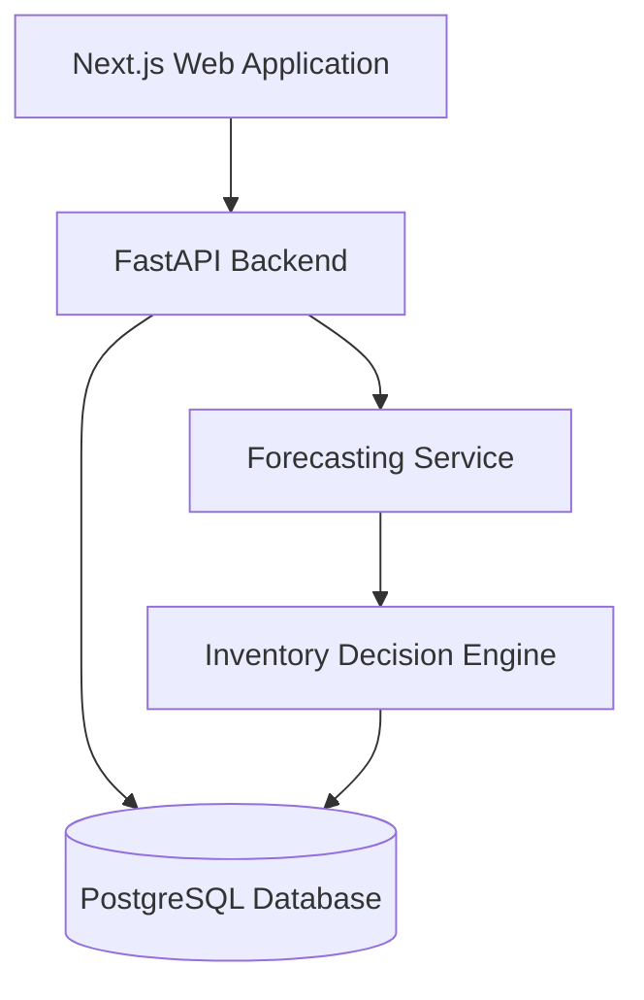

Portfolio project: RetailPulse AI

An AI-powered demand forecasting and inventory decision platform for Malaysian SMEs.

A shop manager uploads sales and inventory data. The system then:

Forecasts demand for each product.
Predicts possible stockouts and overstock.
Recommends when and how much to reorder.
Detects unusual sales changes.
Simulates promotions such as “10% discount next month.”
Explains why demand is expected to increase or decrease.
Displays everything through a proper full-stack web application.

This is much stronger than another ordinary dashboard because users can act on the predictions.

Why this project is genuinely relevant
Evidence	What it proves
The World Economic Forum identifies AI and big data as the fastest-growing skills through 2030. Big-data specialists, AI/ML specialists, and software/application developers are among the fastest-growing roles. WEF Future of Jobs 2025	Your project targets skills expected to remain valuable over the next five years.
Malaysia’s MyCOL 2024/2025 lists computer systems analysts, software developers, application programmers, data professionals, database specialists and cybersecurity professionals as critical occupations. Software development has remained a shortage occupation across all eight MyCOL editions since 2015. TalentCorp Malaysia	These are not merely “popular” jobs—Malaysia officially identifies shortages in them.
Malaysia generated RM1.288 trillion in e-commerce transaction income during 2024. Department of Statistics Malaysia	Retail and e-commerce remain economically significant local application areas.
Walmart reports using real-time AI to predict demand, reposition inventory and reduce waste across its supply chain. Walmart Corporate	Demand forecasting and inventory AI are already real production use cases.
Target reports that its forecasting and optimisation system reduced warehouse stockouts by approximately 25–30%. Target Technology	Forecasting can be evaluated using measurable business results, not just model accuracy.
US labour projections provide an additional international signal: data-science employment is projected to grow 34%, while software development-related employment is projected to grow 15% from 2024–2034. BLS data science, BLS software development	The technical combination has demand beyond Malaysia too.
What you should build
1. Web application
Login and role-based access for owner, manager and staff.
Product, supplier, inventory and sales management.
CSV sales-data upload.
Responsive dashboard for desktop and mobile.
Forecast, inventory and alert pages.
Downloadable recommendations and reports.
2. Data-science component

Build and compare:

Seasonal naïve forecast as your baseline.
LightGBM or XGBoost using lag, rolling average, price, promotion and holiday features.
Optional Prophet model for comparison.
Anomaly detection for sudden demand changes.
Prediction intervals to show uncertainty.

Use time-series cross-validation—not a random train/test split. Otherwise, future information can leak into training and give you suspiciously beautiful results. Academic catfishing, basically.

Evaluate with:

MAE
RMSE
WMAPE
Forecast bias
Stockout rate
Inventory holding cost
Product availability or fill rate
3. Inventory recommendation engine

Instead of stopping at “next month’s demand is 300 units,” calculate:

Reorder point
Safety stock
Recommended order quantity
Expected stockout date
Excess-stock risk
Supplier lead-time impact

This turns prediction into prescriptive analytics, which is far more impressive.

4. Promotion simulator

Allow users to change:

Discount percentage
Promotion duration
Supplier lead time
Safety-stock level
Expected demand increase

The application recalculates demand, revenue, inventory requirements and stockout risk. This demonstrates information systems thinking because the ML result becomes part of an actual business workflow.

Recommended technology stack
Area	Technology
Frontend	Next.js, TypeScript, Tailwind CSS and Recharts
Backend	FastAPI and Python
Database	PostgreSQL
Machine learning	Pandas, scikit-learn, LightGBM/XGBoost and SHAP
Authentication	Supabase Auth or JWT
Model tracking	MLflow
Testing	Pytest and Playwright
Deployment	Docker, GitHub Actions, Vercel and Render/Railway
Monitoring	Structured logs, model-error tracking and data-drift checks

Don’t make Power BI the main interface. You already have dashboard experience from your AirAsia project. A deployed web product will demonstrate a new layer of ability.

Suitable datasets

Start with the official M5 Forecasting competition dataset, containing hierarchical Walmart sales data. It was specifically designed for forecasting daily retail demand.

You could also use the UCI Online Retail II dataset, which contains more than one million real transactions.

For Malaysian localisation, add clearly labelled synthetic information such as:

Prices in RM.
Malaysian suppliers.
Hari Raya, Chinese New Year and Deepavali calendar features.
Local promotion periods.
Simulated supplier lead times.

Never claim synthetic Malaysian sales are real—recruiters can smell data cosplay.

Realistic development scope

Build the MVP first:

User authentication and database.
Sales-data upload and validation.
Demand-forecasting pipeline.
Product forecast dashboard.
Reorder recommendation engine.
Deployment, automated tests and documentation.

After that, add:

Promotion simulator.
Email or in-app stockout alerts.
SHAP explanations.
Model monitoring.
Customer-review sentiment as an external demand signal.

I would keep sentiment as a later feature because you already demonstrated NLP and sentiment analysis through your AirAsia project. Your next project should broaden your portfolio into forecasting, optimisation, APIs, system design and deployment.

What recruiters would see

This single project can demonstrate:

Software requirements and architecture.
Full-stack TypeScript/Python development.
REST API design.
SQL and database modelling.
Machine-learning experimentation.
Time-series forecasting.
Business optimisation.
Testing and CI/CD.
Cloud deployment.
Explainable AI and model monitoring.
Clear communication of business value.

A future résumé bullet could become:

Developed and deployed a full-stack retail intelligence platform using Next.js, FastAPI and PostgreSQL, combining time-series demand forecasting with automated reorder recommendations; reduced simulated stockouts by X% compared with a seasonal-naïve inventory policy.

Replace X% with your actual experimental result. Never invent it—the truth looks hotter anyway.

My honest verdict: this is a better portfolio move for you than another sentiment dashboard or generic chatbot. It connects your Data Science master’s background with software engineering and web development while solving a problem that real retailers are actively investing in.

can we do list down first, where should i start with this project?

Absolutely. We should build it in controlled stages so it doesn’t evolve into a 47-feature final boss.

Overall project roadmap
Phase 1 — Define the project

Start here before coding.

Choose the project name.

Suggested name: RetailPulse AI

Define the problem:

Small retailers may experience stockouts or excess inventory because they rely on manual judgement instead of data-driven demand forecasts.

Define the proposed solution:

A web-based platform that forecasts product demand, identifies stockout risks and recommends appropriate reorder quantities.

Define the target users:
Small retail business owner
Inventory manager
Store manager

Define the main objective:

To develop and evaluate a full-stack retail intelligence platform that uses machine learning to support inventory-replenishment decisions.

Phase 2 — Control the scope
Minimum viable product

The first completed version should contain only:

User login
Sales-data upload
Product and inventory database
Sales dashboard
Demand forecast for the next 7 or 28 days
Low-stock prediction
Reorder recommendation
Forecast-performance page

Do not begin with chatbots, live sentiment, computer vision or ten different ML models. Those can wait politely outside.

Future enhancements

After the MVP works:

Promotion simulator
Email or in-app alerts
Forecast explanations
Customer-review sentiment
Malaysian holiday effects
Model monitoring
Multiple stores and suppliers
Phase 3 — Select the dataset

Start with the M5 Forecasting dataset.

It contains:

Daily product sales
Multiple products
Several stores
Product prices
Promotion-related events
Calendar and holiday information

You do not need to use the entire dataset immediately. Start with:

One store
One product category
Approximately 50–100 products
One or two years of sales

Working with a smaller sample will make development and model experimentation much easier.

Phase 4 — Understand and prepare the data

Your first technical work should be an exploratory notebook.

Check:

Dataset size
Date range
Number of stores
Number of products
Missing values
Zero-sales days
Product sales distributions
Weekly and monthly patterns
Holiday or promotion effects
Products with intermittent demand

Create these initial charts:

Total sales over time
Daily sales by category
Top-selling products
Sales by day of the week
Promotion versus non-promotion sales
Missing and zero-sales distribution

At the end of this phase, produce one clean modelling table:

date	product_id	store_id	sales	price	promotion	holiday
Phase 5 — Build the baseline forecast

Before using machine learning, create a simple baseline.

Examples:

Tomorrow’s sales equal today’s sales.
Next Monday’s sales equal last Monday’s sales.
Next week’s sales equal the average of the previous four weeks.

Evaluate it using:

MAE
RMSE
WMAPE
Forecast bias

The baseline is important because your ML model must prove that it performs better than a simple method.

Phase 6 — Build the machine-learning model

Begin with one main model: LightGBM.

Create features such as:

Sales from 1, 7, 14 and 28 days ago
Seven-day rolling average
Twenty-eight-day rolling average
Day of week
Month
Weekend indicator
Product price
Promotion indicator
Holiday indicator

Compare:

Model	Purpose
Seasonal naïve	Baseline
Linear regression	Simple statistical comparison
LightGBM	Main machine-learning model

Use time-based validation:

Training: earlier dates
Validation: later dates
Testing: latest dates

Never randomly split time-series data because that can leak future information into training.

Phase 7 — Create the inventory engine

Once forecasting works, convert the forecast into recommendations.

The system should calculate:

Predicted demand during supplier lead time
Safety stock
Reorder point
Current stock coverage
Expected stockout date
Recommended order quantity

Example output:

Product A currently has 42 units. Predicted 14-day demand is 61 units. The product has a high stockout risk. Recommended reorder quantity: 35 units.

Initially, use simulated inventory and supplier information:

product_id	current_stock	lead_time_days	minimum_order
P001	42	7	20

Clearly label this information as simulated.

Phase 8 — Design the system

Before developing the website, prepare:

Use-case diagram
System architecture
Database ERD
API endpoint list
Basic interface wireframes

Suggested database tables:

users
stores
products
sales
inventory
forecasts
reorder_recommendations
model_runs

Suggested pages:

Login
Overview dashboard
Product management
Sales-data upload
Demand forecast
Inventory risks
Reorder recommendations
Model performance
Phase 9 — Develop the application

Build it in this order:

PostgreSQL database
FastAPI backend
Data-upload API
Forecast API
Inventory-recommendation API
Next.js frontend
Authentication
Dashboard visualisations
Testing
Deployment

Keeping the ML model behind an API demonstrates that you understand how models are used inside real software systems.

Phase 10 — Evaluate the complete project

Evaluate both the model and the system.

Model evaluation
MAE
WMAPE
Forecast bias
Performance against baseline
Business evaluation

Run a simulation comparing:

Manual/basic reorder policy
Forecast-based reorder policy

Measure:

Stockout rate
Excess inventory
Product availability
Estimated holding cost
Software evaluation
API response time
Test coverage
Invalid-file handling
Authentication and authorisation
Mobile responsiveness
What you should do first

For now, complete only these five tasks:

Finalise the project title.
Write the problem statement.
Write one main objective and three specific objectives.
Download and inspect the M5 dataset.
Create a GitHub repository with data, notebooks, backend, frontend, models and docs folders.

Your first real deliverable should be a short Project Proposal and Scope, followed by an EDA notebook. The website comes later—first we teach the brain, then we give it a pretty face.

please generate markdown file for my project
Worked for 2m 17s

Created the complete Markdown project plan, including objectives, MVP scope, dataset, modelling approach, architecture, database tables, evaluation plan, development roadmap, and starting checklist.

RetailPulse_AI_Project_Plan.md

okay, based on the planning, please suggest me first the exact workflow and software to use and the function and validation and evaluation should i use for this project.

Yes. Below is the exact workflow I recommend for RetailPulse AI, including the software, system functions, validation methods, and evaluation metrics. The key is to build one reliable end-to-end system first—not summon every technology known to humankind.

1. Exact technology stack
Area	Software/Technology	Function
Development	VS Code	Main code editor
Version control	Git and GitHub	Store code, manage versions and present portfolio
Data exploration	Jupyter Notebook	EDA, feature engineering and model experiments
Programming	Python	Data processing, machine learning and backend
Data processing	Pandas and NumPy	Clean, transform and analyse data
Data validation	Pandera	Validate uploaded and processed datasets
Machine learning	scikit-learn and LightGBM	Baselines, preprocessing and forecasting
Explainability	SHAP	Explain important forecast factors
Model tracking	MLflow	Record model parameters, metrics and versions
Backend	FastAPI	Provide APIs for the web application
API validation	Pydantic	Validate API requests and responses
Database	PostgreSQL	Store users, products, sales, inventory and predictions
Database management	DBeaver	View and query PostgreSQL easily
Frontend	Next.js with TypeScript	Build the web interface
Styling	Tailwind CSS	Design the interface
Charts	Recharts	Display sales, forecasts and inventory risks
Authentication	Supabase Auth	Registration, login and user sessions
API testing	Postman or Bruno	Test backend endpoints
Backend testing	Pytest	Test Python functions and APIs
Frontend testing	Vitest and Playwright	Test components and user workflows
Containerisation	Docker and Docker Compose	Run the system consistently
Automation	GitHub Actions	Automatically run tests
Deployment	Vercel, Render and Supabase	Deploy frontend, backend and database

For the first version, skip Redis, Kafka, Kubernetes, deep learning and microservices. They would create extra work without improving the actual project.

2. Exact development workflow
Phase 1 — Define the system
Target user

Start with one user role:

A store manager responsible for monitoring product inventory and deciding what to reorder.

You may add an administrator role later.

Main workflow
Forecasting scope

Use:

One store
One product category
50–100 products
Daily sales
28-day forecasting horizon

This is enough to demonstrate hierarchical retail forecasting without making your laptop file a restraining order.

Phase 2 — Set up the project

Create this structure:

retailpulse-ai/
├── backend/
│   ├── app/
│   │   ├── api/
│   │   ├── models/
│   │   ├── schemas/
│   │   ├── services/
│   │   └── main.py
│   └── tests/
├── frontend/
├── data/
│   ├── raw/
│   ├── processed/
│   └── sample/
├── notebooks/
├── models/
├── scripts/
├── docs/
├── docker-compose.yml
├── README.md
└── .gitignore

Initial software setup:

Install VS Code.
Install Python and the current Node.js LTS version.
Install Git.
Install Docker Desktop.
Create a GitHub repository.
Create a Python virtual environment.
Create the Next.js frontend.
Start PostgreSQL using Docker Compose.

Do not upload the entire M5 dataset to GitHub. Include a small sample and instructions for downloading the full dataset.

Phase 3 — Prepare the dataset

Use the M5 files containing:

Daily unit sales
Calendar information
Product prices
Events
SNAP or promotion indicators
Store and product identifiers

Transform the wide M5 sales table into this long format:

date	store_id	product_id	category	sales	price	event	promotion
Data-cleaning functions

Create functions such as:

def load_m5_data():
    pass

def reshape_sales_to_long_format():
    pass

def merge_calendar_and_prices():
    pass

def validate_sales_data():
    pass

def create_modelling_dataset():
    pass

Each function should perform one clear task. Avoid putting the entire pipeline into one enormous notebook cell called “final_final_really_final.”

3. Data validation

Use Pandera to define the expected dataset schema.

Required validations
Column	Validation
date	Must be a valid date
product_id	Cannot be empty
store_id	Cannot be empty
sales	Integer and greater than or equal to zero
price	Greater than zero
current_stock	Greater than or equal to zero
lead_time_days	Integer between 1 and 90
promotion	Only 0 or 1

Also validate:

Required columns are present.
No duplicate date + store_id + product_id combination.
No future sales dates.
Missing prices are handled.
Sales cannot be negative.
Inventory cannot be negative.
Uploaded files are CSV files.
Empty files are rejected.
Extremely large files are restricted.
Validation output

Do not only display “Upload failed.”

Return useful messages such as:

Row 27: sales contains a negative value.

Required column product_id is missing.

Five duplicate product-date records were detected.

This demonstrates good software engineering and usability.

4. Exploratory data analysis

Create one notebook named:

01_m5_exploratory_data_analysis.ipynb

Analyse:

Date coverage
Number of stores and products
Missing values
Zero-sales frequency
Total daily sales
Weekly patterns
Monthly patterns
Product-level demand
Promotion effects
Event and holiday effects
Intermittent-demand products
Price changes

The notebook should end by creating a processed modelling dataset, not merely displaying colourful graphs and disappearing into the night.

5. Feature engineering

Create these features for every product and date.

Historical demand features
sales_lag_1
sales_lag_7
sales_lag_14
sales_lag_28
rolling_mean_7
rolling_mean_14
rolling_mean_28
rolling_std_28

Rolling features must use shifted sales:

df["rolling_mean_7"] = (
    df.groupby("product_id")["sales"]
      .transform(lambda x: x.shift(1).rolling(7).mean())
)

The shift(1) is essential. Without it, today’s actual sales leak into today’s prediction.

Calendar features
Day of week
Week of year
Month
Weekend indicator
Holiday indicator
Event type
Commercial features
Current price
Previous price
Price-change percentage
Promotion indicator
Number of promotion days in the previous month

Create the feature engineering as a reusable function:

def create_forecasting_features(df):
    pass

The notebook and backend must use the same function to prevent training-serving mismatch.

6. Model development
Model 1 — Seasonal naive baseline

Primary baseline:

forecast_today = sales_7_days_ago

You can also test:

forecast = average_sales_of_previous_28_days

A machine-learning model is valuable only if it beats a reasonable baseline.

Model 2 — Linear regression

Use linear regression as a simple interpretable comparison.

Model 3 — LightGBM

Use LightGBM as the main model because it:

Works well with tabular retail data.
Handles nonlinear relationships.
Trains faster than many deep-learning models.
Supports feature importance and SHAP.
Is suitable for lag, calendar, price and promotion features.

For the initial version, use a regression objective. Predictions below zero must be converted to zero:

predictions = np.maximum(predictions, 0)

Do not begin with LSTM or Transformers. They are harder to validate, explain and deploy, and they do not automatically outperform gradient boosting.

7. Forecast validation method
Time-based holdout

Split the dataset by time:

Dataset	Period
Training	All dates except the final 56 days
Validation	Days −56 to −29
Testing	Final 28 days

The test set must remain untouched until the model and hyperparameters are finalised.

Rolling-origin validation

For stronger validation, conduct three forecast rounds:

Fold	Training	Validation
Fold 1	Earlier period	Next 28 days
Fold 2	Extended training period	Following 28 days
Fold 3	Further extended period	Following 28 days

This checks whether the model remains reliable across different periods.

Never use random train-test splitting for this project.

8. Forecast evaluation
Primary metric — WMAPE

Use Weighted Mean Absolute Percentage Error:

WMAPE
=
∑
∣
𝑦
𝑖
−
𝑦
^
𝑖
∣
∑
∣
𝑦
𝑖
∣
×
100
WMAPE=
∑∣y
i
	​

∣
∑∣y
i
	​

−
y
^
	​

i
	​

∣
	​

×100

WMAPE is suitable because high-selling products receive appropriate weight and zero-sales rows do not individually cause division errors.

Lower is better.

Secondary metrics
Mean Absolute Error
MAE
=
1
𝑛
∑
∣
𝑦
𝑖
−
𝑦
^
𝑖
∣
MAE=
n
1
	​

∑∣y
i
	​

−
y
^
	​

i
	​

∣

Easy to explain as average unit prediction error.

Root Mean Squared Error

RMSE penalises large forecasting errors more strongly.

Forecast bias
Bias
=
1
𝑛
∑
(
𝑦
^
𝑖
−
𝑦
𝑖
)
Bias=
n
1
	​

∑(
y
^
	​

i
	​

−y
i
	​

)
Positive bias: systematic overforecasting
Negative bias: systematic underforecasting
Near zero: more balanced forecasting
RMSSE

Because this uses the M5 dataset, you may also report Root Mean Squared Scaled Error. It allows performance comparisons across products with different sales volumes.

Model comparison table

Your report should eventually contain:

Model	WMAPE	MAE	RMSE	Bias
Seasonal naive	—	—	—	—
Linear regression	—	—	—	—
LightGBM	—	—	—	—
Model selection rule

Select LightGBM only if it:

Beats the seasonal baseline on test-set WMAPE.
Performs better across most validation folds.
Does not create extreme forecast bias.
Produces stable results for both high- and low-demand products.

If a simple model performs better, report that honestly. A scientifically honest result is more impressive than forcing LightGBM to win because it wore the fanciest outfit.

9. Inventory recommendation functions

Use simulated inventory values initially.

Safety stock

For a 95% service level:

Safety Stock
=
1.645
×
𝜎
lead-time demand
Safety Stock=1.645×σ
lead-time demand
	​

Reorder point
Reorder Point
=
Expected Demand During Lead Time
+
Safety Stock
Reorder Point=Expected Demand During Lead Time+Safety Stock
Stockout risk

Suggested categories:

Condition	Risk
Current stock ≤ predicted lead-time demand	High
Current stock ≤ reorder point	Medium
Current stock > reorder point	Low
Reorder quantity
Recommended Quantity
=
max
⁡
(
0
,
Target Stock
−
Current Stock
−
On-Order Stock
)
Recommended Quantity=max(0,Target Stock−Current Stock−On-Order Stock)

Then adjust it according to minimum order quantity.

Required Python functions
def calculate_lead_time_demand():
    pass

def calculate_safety_stock():
    pass

def calculate_reorder_point():
    pass

def classify_stockout_risk():
    pass

def calculate_reorder_quantity():
    pass

def estimate_stockout_date():
    pass
10. Required system functions
User functions
Function	Description
Register	Create an account
Login/logout	Manage authenticated sessions
View profile	Display user information
Select store	Access a specific store
Data functions
Function	Description
Upload sales CSV	Import historical sales
Validate data	Detect missing or invalid records
View upload history	Show previous imports
Manage products	Create, edit and view products
Update inventory	Record current stock and lead time
Forecasting functions
Function	Description
Generate forecast	Produce the next 7 or 28 days of demand
View forecast	Compare history and predicted demand
View uncertainty	Show lower and upper forecast ranges
Explain forecast	Show important features using SHAP
View model performance	Compare actual and predicted sales
Inventory functions
Function	Description
Detect stockout risk	Categorise products as low, medium or high risk
Calculate reorder point	Determine when ordering is required
Recommend quantity	Estimate how many units should be ordered
Estimate stockout date	Predict when current inventory may reach zero
Export recommendations	Download results as CSV
11. Suggested backend API
Method	Endpoint	Function
POST	/sales/upload	Upload sales data
GET	/sales/summary	Retrieve sales KPIs
GET	/products	List products
POST	/products	Create a product
PUT	/inventory/{product_id}	Update inventory
POST	/forecasts/generate	Generate forecasts
GET	/forecasts/{product_id}	Retrieve product forecast
GET	/model/performance	Retrieve evaluation results
POST	/recommendations/generate	Generate inventory recommendations
GET	/recommendations	Retrieve recommendations
GET	/alerts	Retrieve high-risk products

Use Pydantic schemas to validate every API input and output.

12. Inventory-policy evaluation

Do not evaluate inventory recommendations using forecasting accuracy alone.

Run a historical simulation over the test period.

Compare two policies
Baseline policy

Order a fixed amount whenever inventory falls below a fixed threshold.

Forecast-based policy

Use predicted lead-time demand, safety stock and reorder recommendations.

Both policies must use:

The same starting inventory
The same actual test-period demand
The same supplier lead time
The same delivery assumptions
The same product costs
Business metrics
Metric	Meaning
Stockout rate	Percentage of days with insufficient inventory
Fill rate	Percentage of customer demand fulfilled
Lost sales	Demand that could not be fulfilled
Average inventory	Average units held
Holding cost	Cost of carrying excess inventory
Number of orders	Purchasing frequency
Emergency reorders	Unexpected urgent purchases
Total inventory cost	Holding, ordering and stockout costs combined

The forecast-based policy succeeds if it reduces stockouts or total cost without creating unreasonable excess inventory.

13. Software validation and testing
Unit testing

Test individual functions:

Feature engineering
WMAPE calculation
Safety-stock calculation
Reorder-point calculation
Risk classification
CSV schema validation

Example:

def test_reorder_point_is_demand_plus_safety_stock():
    assert calculate_reorder_point(100, 20) == 120
Integration testing

Test whether components work together:

CSV upload → validation → database
Database → model → forecast storage
Forecast → inventory engine → recommendation
Backend API → frontend dashboard
End-to-end testing

Use Playwright to test complete user workflows:

User logs in.
User uploads sales data.
System validates the file.
User generates a forecast.
Dashboard displays the result.
User opens recommendations.
User exports the report.
Security validation

Check that:

Unauthenticated users cannot access protected pages.
Users cannot access another store’s records.
File types and upload sizes are restricted.
Passwords are not stored directly.
SQL queries are parameterised.
Secrets are stored in environment variables.
Personal credentials are excluded from GitHub.
Performance validation

Record:

CSV processing time
Forecast generation time
Dashboard loading time
API response time
Database query time

For an MVP, normal API requests should preferably respond in under two seconds. Model training can take longer and should be treated as a separate process.

14. User validation

Ask approximately five users—classmates, small sellers or people familiar with inventory—to complete these tasks:

Upload a sales file.
Find the highest-risk product.
View its 28-day forecast.
identify the recommended order quantity.
Export the recommendations.

Measure:

Task completion rate
Time taken
Number of errors
User comments
System Usability Scale, or SUS

A good usability target is:

At least 80% task-completion rate
SUS score of approximately 68 or higher
No critical task that users consistently fail
15. Final evaluation structure

Your final project should evaluate four separate areas:

Evaluation Area	Main Question
Data validation	Is the input data complete, valid and consistent?
Model validation	Does the forecast generalise to unseen dates?
Business evaluation	Does the inventory policy reduce stockouts or costs?
Software evaluation	Is the system correct, secure, usable and responsive?

This distinction is important. High model accuracy does not automatically mean a useful system.

16. Exact order to begin

Your immediate working order should be:

Create the GitHub repository and project folders.
Download the M5 dataset.
Select one store, category and 50–100 products.
Create the Pandera data schema.
Complete the EDA notebook.
Convert the data into long format.
Create lag and rolling features.
Build the seasonal naive baseline.
Record baseline WMAPE, MAE, RMSE and bias.
Train LightGBM.
Conduct time-based validation.
Build the inventory calculation functions.
Run the inventory-policy simulation.
Design PostgreSQL tables and FastAPI endpoints.
Build the web interface.
Add tests and deploy the application.

The first milestone is therefore not the website. It is a validated dataset plus a seasonal-naive baseline. Once those work correctly, the rest of the system has a reliable foundation.

Library
/
RetailPulse_AI_Project_Plan.md
# RetailPulse AI

## AI-Powered Demand Forecasting and Inventory Decision Platform

RetailPulse AI is a full-stack retail intelligence platform designed to help small and medium-sized retailers make better inventory decisions. The platform uses historical sales data to forecast product demand, identify potential stockouts or excess inventory, and recommend when and how much stock should be reordered.

The project combines **data science**, **machine learning**, **software engineering**, **web development**, **database design**, and **information systems engineering** in one deployable product.

---

## 1. Problem Statement

Small retailers often make inventory decisions using manual calculations, spreadsheets, or personal judgement. These methods may result in:

- Products running out of stock when customers need them.
- Excess inventory that increases storage and holding costs.
- Poor preparation for seasonal demand and promotions.
- Difficulty identifying changing sales patterns early.
- Limited understanding of how forecasts should influence purchasing decisions.

RetailPulse AI addresses this problem by converting sales and inventory data into understandable forecasts, risk alerts, and reorder recommendations.

---

## 2. Proposed Solution

The platform will allow a retail manager to upload sales data and manage product inventory through a web application. It will then:

1. Analyse historical product sales.
2. Forecast demand for the next 7 or 28 days.
3. Detect products at risk of stockout or overstock.
4. Estimate when a product may run out.
5. Calculate safety stock and reorder points.
6. Recommend an appropriate reorder quantity.
7. Display model performance and prediction explanations.

---

## 3. Target Users

- Small retail business owners
- Inventory managers
- Store managers
- Purchasing staff
- E-commerce sellers

---

## 4. Project Objectives

### Main Objective

To develop and evaluate a full-stack retail intelligence platform that uses machine learning to support demand forecasting and inventory replenishment decisions.

### Specific Objectives

1. To prepare and analyse historical retail sales, product, price, promotion, and calendar data.
2. To develop and compare baseline and machine-learning models for short-term product demand forecasting.
3. To design an inventory decision engine that calculates stockout risk, reorder points, safety stock, and recommended order quantities.
4. To develop a web-based system that presents forecasts and inventory recommendations through an accessible dashboard.
5. To evaluate the platform using forecasting, business, and software performance metrics.

---

## 5. Minimum Viable Product

The first complete version will contain:

- User registration and login
- Role-based access
- Product and inventory management
- CSV sales-data upload
- Data validation and error reporting
- Sales overview dashboard
- Product-level demand forecasting
- Low-stock and stockout-risk detection
- Reorder recommendations
- Forecast-performance dashboard
- Exportable recommendation report

### Features Outside the Initial MVP

These features may be added after the core system works:

- Promotion scenario simulator
- Email or in-app alerts
- Multiple stores and suppliers
- Customer-review sentiment analysis
- External trend or weather data
- Model drift monitoring
- AI-generated management summaries

---

## 6. Data Source

### Primary Dataset

The project will begin with the [M5 Forecasting Accuracy dataset](https://www.kaggle.com/competitions/m5-forecasting-accuracy), which contains hierarchical daily Walmart sales data, product prices, stores, calendar events, and promotion-related information.

To keep the first version manageable, development should begin with:

- One store
- One product category
- Approximately 50 to 100 products
- One to two years of sales history

### Optional Dataset

The [UCI Online Retail II dataset](https://archive.ics.uci.edu/ml/datasets/online%2Bretail%2BII) may later be used for transaction-level analysis.

### Malaysian Localisation

The demonstration system may include clearly labelled simulated information such as:

- Prices in Malaysian Ringgit
- Malaysian supplier names
- Supplier lead times
- Hari Raya, Chinese New Year, Deepavali and school-holiday indicators
- Local promotion periods

Synthetic information must not be presented as genuine business data.

---

## 7. Data Preparation

The data pipeline will:

1. Load sales, product, price, store and calendar files.
2. Standardise column names and data types.
3. Convert dates into a consistent format.
4. Identify missing values and duplicate records.
5. Investigate zero-sales days and possible stockouts.
6. Merge sales with price, event and promotion information.
7. Create a clean modelling table.

Example modelling structure:

| date | product_id | store_id | sales | price | promotion | holiday |
|---|---|---|---:|---:|---:|---:|
| 2025-01-01 | P001 | S001 | 18 | 12.90 | 0 | 1 |

### Initial Exploratory Analysis

- Total sales over time
- Sales by product category
- Top-selling and slow-moving products
- Sales by day of the week and month
- Promotion versus non-promotion sales
- Holiday and seasonal patterns
- Missing-value distribution
- Zero-sales and intermittent-demand patterns

---

## 8. Forecasting Methodology

### Baseline Models

At least one simple baseline must be created before training a machine-learning model:

- Naive forecast: future sales equal the most recent sales value.
- Seasonal naive forecast: future sales equal sales from the same day in the previous week.
- Moving average: future sales equal the average of the previous four weeks.

### Machine-Learning Models

The initial comparison will include:

| Model | Purpose |
|---|---|
| Seasonal naive | Main baseline |
| Linear regression | Simple statistical comparison |
| LightGBM or XGBoost | Main machine-learning model |

### Candidate Features

- Sales lagged by 1, 7, 14 and 28 days
- Seven-day and twenty-eight-day rolling averages
- Rolling standard deviation
- Day of week
- Week and month
- Weekend indicator
- Product price
- Price change
- Promotion indicator
- Holiday or event indicator
- Product and store identifiers

### Validation Strategy

The project will use time-based splitting or rolling time-series cross-validation:

- Training set: earliest dates
- Validation set: later dates
- Test set: most recent unseen dates

Random train-test splitting will not be used for forecasting because it may leak future information into model training.

---

## 9. Inventory Decision Engine

The inventory engine will convert predicted demand into operational recommendations.

### Main Calculations

- Demand during supplier lead time
- Safety stock
- Reorder point
- Current stock coverage
- Estimated stockout date
- Recommended reorder quantity
- Excess-inventory risk

### Example Recommendation

> Product P001 currently has 42 units in stock. Predicted demand during the next 14 days is 61 units. The product has a high stockout risk. Recommended reorder quantity: 35 units.

Example inventory information:

| product_id | current_stock | lead_time_days | minimum_order_quantity |
|---|---:|---:|---:|
| P001 | 42 | 7 | 20 |

---

## 10. Functional Requirements

### User Management

- Users can register and log in securely.
- Administrators can manage user roles.
- Users can access only authorised stores and information.

### Data Management

- Users can upload sales data in CSV format.
- The system validates required columns and data types.
- Invalid records are reported clearly.
- Users can create, update and view product inventory.

### Forecasting

- Users can request a 7-day or 28-day forecast.
- The system stores forecast results and model versions.
- Users can compare predictions with actual sales.

### Inventory Recommendations

- The system identifies products with high stockout risk.
- Users can review reorder quantities and supporting calculations.
- Users can filter recommendations by store, product and risk level.

---

## 11. Suggested Technology Stack

| Component | Technology |
|---|---|
| Frontend | Next.js, TypeScript, Tailwind CSS |
| Charts | Recharts |
| Backend | FastAPI and Python |
| Database | PostgreSQL |
| Data science | Pandas, NumPy, scikit-learn |
| Forecasting | LightGBM or XGBoost |
| Explainability | SHAP |
| Authentication | Supabase Auth or JWT |
| Model tracking | MLflow |
| Testing | Pytest, Vitest and Playwright |
| Packaging | Docker |
| Automation | GitHub Actions |
| Deployment | Vercel and Render, Railway or another suitable cloud service |

---

## 12. Proposed System Architecture



---

## 13. Proposed Database Tables

| Table | Purpose |
|---|---|
| users | Stores user accounts and roles |
| stores | Stores retail outlet information |
| products | Stores product details |
| sales | Stores historical product sales |
| inventory | Stores stock quantity and supplier lead time |
| forecasts | Stores predicted product demand |
| reorder_recommendations | Stores inventory recommendations and risk levels |
| model_runs | Stores model version, parameters and evaluation results |

---

## 14. Main Web Pages

1. Login and registration
2. Overview dashboard
3. Product management
4. Inventory management
5. Sales-data upload
6. Demand forecast
7. Inventory risk dashboard
8. Reorder recommendations
9. Model performance
10. User and system settings

---

## 15. Evaluation Plan

### Forecasting Evaluation

- Mean Absolute Error (MAE)
- Root Mean Squared Error (RMSE)
- Weighted Mean Absolute Percentage Error (WMAPE)
- Forecast bias
- Performance improvement over the seasonal naive baseline

### Business Evaluation

The forecast-based reorder policy will be compared with a simple inventory policy using simulation.

- Stockout rate
- Product availability or fill rate
- Excess inventory
- Estimated inventory holding cost
- Number of emergency reorders

### Software Evaluation

- API response time
- Automated test results
- Data-upload validation
- Authentication and authorisation checks
- Error handling
- Mobile responsiveness
- Usability feedback

---

## 16. Development Roadmap

### Phase 1: Planning

- Finalise title, problem statement and objectives.
- Define the MVP and features outside the initial scope.
- Create the GitHub repository and folder structure.

### Phase 2: Data Understanding

- Download and inspect the M5 dataset.
- Select the initial store, category and products.
- Complete data cleaning and exploratory analysis.
- Produce the modelling dataset.

### Phase 3: Forecasting

- Build baseline forecasts.
- Create time-series features.
- Train and compare machine-learning models.
- Evaluate the final model on unseen dates.

### Phase 4: Inventory Intelligence

- Define inventory assumptions.
- Calculate safety stock and reorder points.
- Generate stockout-risk levels and reorder recommendations.
- Evaluate the policy through simulation.

### Phase 5: System Development

- Design the ERD, API and wireframes.
- Develop the PostgreSQL database and FastAPI backend.
- Develop the Next.js frontend.
- Integrate the forecast and inventory services.

### Phase 6: Quality and Deployment

- Add automated tests and error handling.
- Containerise the application.
- Configure continuous integration.
- Deploy the application.
- Prepare the demonstration video and project documentation.

---

## 17. Suggested Repository Structure

```text
retailpulse-ai/
├── backend/
│   ├── app/
│   ├── tests/
│   └── requirements.txt
├── frontend/
│   ├── src/
│   └── tests/
├── data/
│   ├── raw/
│   ├── processed/
│   └── sample/
├── models/
├── notebooks/
├── docs/
├── scripts/
├── docker-compose.yml
├── README.md
└── LICENSE
```

Large raw datasets and confidential information should not be committed to GitHub. Include a small sample dataset and clear download instructions instead.

---

## 18. Immediate Starting Checklist

- [ ] Confirm the name **RetailPulse AI**.
- [ ] Finalise the problem statement and objectives.
- [ ] Create the GitHub repository.
- [ ] Download the M5 dataset.
- [ ] Read the dataset documentation.
- [ ] Select one store and product category.
- [ ] Create the first exploratory analysis notebook.
- [ ] Check dates, missing values and zero-sales days.
- [ ] Create initial sales visualisations.
- [ ] Build the seasonal naive baseline.
- [ ] Record the baseline MAE, RMSE and WMAPE.

---

## 19. Evidence of Industry Relevance

- The [World Economic Forum Future of Jobs Report 2025](https://www.weforum.org/publications/the-future-of-jobs-report-2025/digest/) identifies AI and big data among the fastest-growing skills through 2030.
- [TalentCorp Malaysia's MyCOL 2024/2025](https://www.talentcorp.com.my/images/uploads/publication/205/MyMahir-MyCOL-20242025-Brochure-1773377416.pdf) identifies software developers, computer systems analysts, application programmers and data professionals as critical occupations in Malaysia.
- The [Department of Statistics Malaysia](https://www.dosm.gov.my/portal-main/release-content/usage-of-ict-and-e-commerce-by-establishment2025) reported RM1.288 trillion in Malaysian e-commerce transaction income during 2024.
- [Walmart](https://corporate.walmart.com/news/2025/07/17/walmarts-us-supply-chain-playbook-goes-global-and-its-reinventing-retail-at-scale) reports using real-time AI to predict demand, reposition inventory and reduce waste.
- [Target Technology](https://tech.target.com/blog/math-behind-inventory-delivery-optimization) reports that its forecasting and optimisation system reduced warehouse stockouts by approximately 25 to 30 percent.

---

## 20. Expected Portfolio Outcomes

After completion, the project should demonstrate:

- Business-problem identification
- Requirements and information-system design
- Database modelling and SQL
- Data cleaning and feature engineering
- Time-series forecasting
- Machine-learning evaluation
- Prescriptive inventory analytics
- REST API development
- Full-stack web development
- Authentication and security awareness
- Automated testing and CI/CD
- Cloud deployment
- Technical documentation and presentation

### Future Resume Bullet Template

> Developed and deployed a full-stack retail intelligence platform using Next.js, FastAPI and PostgreSQL, combining time-series demand forecasting with automated reorder recommendations; reduced simulated stockouts by **X%** compared with a seasonal-naive inventory policy.

Replace **X%** with the actual experimental result after completing the inventory simulation.

---

## Project Status

**Current stage:** Planning and dataset selection

**Next deliverable:** Exploratory data analysis notebook and seasonal naive forecasting baseline

Library
/
RetailPulse_AI_Project_Plan.md
# RetailPulse AI

## AI-Powered Demand Forecasting and Inventory Decision Platform

RetailPulse AI is a full-stack retail intelligence platform designed to help small and medium-sized retailers make better inventory decisions. The platform uses historical sales data to forecast product demand, identify potential stockouts or excess inventory, and recommend when and how much stock should be reordered.

The project combines **data science**, **machine learning**, **software engineering**, **web development**, **database design**, and **information systems engineering** in one deployable product.

---

## 1. Problem Statement

Small retailers often make inventory decisions using manual calculations, spreadsheets, or personal judgement. These methods may result in:

- Products running out of stock when customers need them.
- Excess inventory that increases storage and holding costs.
- Poor preparation for seasonal demand and promotions.
- Difficulty identifying changing sales patterns early.
- Limited understanding of how forecasts should influence purchasing decisions.

RetailPulse AI addresses this problem by converting sales and inventory data into understandable forecasts, risk alerts, and reorder recommendations.

---

## 2. Proposed Solution

The platform will allow a retail manager to upload sales data and manage product inventory through a web application. It will then:

1. Analyse historical product sales.
2. Forecast demand for the next 7 or 28 days.
3. Detect products at risk of stockout or overstock.
4. Estimate when a product may run out.
5. Calculate safety stock and reorder points.
6. Recommend an appropriate reorder quantity.
7. Display model performance and prediction explanations.

---

## 3. Target Users

- Small retail business owners
- Inventory managers
- Store managers
- Purchasing staff
- E-commerce sellers

---

## 4. Project Objectives

### Main Objective

To develop and evaluate a full-stack retail intelligence platform that uses machine learning to support demand forecasting and inventory replenishment decisions.

### Specific Objectives

1. To prepare and analyse historical retail sales, product, price, promotion, and calendar data.
2. To develop and compare baseline and machine-learning models for short-term product demand forecasting.
3. To design an inventory decision engine that calculates stockout risk, reorder points, safety stock, and recommended order quantities.
4. To develop a web-based system that presents forecasts and inventory recommendations through an accessible dashboard.
5. To evaluate the platform using forecasting, business, and software performance metrics.

---

## 5. Minimum Viable Product

The first complete version will contain:

- User registration and login
- Role-based access
- Product and inventory management
- CSV sales-data upload
- Data validation and error reporting
- Sales overview dashboard
- Product-level demand forecasting
- Low-stock and stockout-risk detection
- Reorder recommendations
- Forecast-performance dashboard
- Exportable recommendation report

### Features Outside the Initial MVP

These features may be added after the core system works:

- Promotion scenario simulator
- Email or in-app alerts
- Multiple stores and suppliers
- Customer-review sentiment analysis
- External trend or weather data
- Model drift monitoring
- AI-generated management summaries

---

## 6. Data Source

### Primary Dataset

The project will begin with the [M5 Forecasting Accuracy dataset](https://www.kaggle.com/competitions/m5-forecasting-accuracy), which contains hierarchical daily Walmart sales data, product prices, stores, calendar events, and promotion-related information.

To keep the first version manageable, development should begin with:

- One store
- One product category
- Approximately 50 to 100 products
- One to two years of sales history

### Optional Dataset

The [UCI Online Retail II dataset](https://archive.ics.uci.edu/ml/datasets/online%2Bretail%2BII) may later be used for transaction-level analysis.

### Malaysian Localisation

The demonstration system may include clearly labelled simulated information such as:

- Prices in Malaysian Ringgit
- Malaysian supplier names
- Supplier lead times
- Hari Raya, Chinese New Year, Deepavali and school-holiday indicators
- Local promotion periods

Synthetic information must not be presented as genuine business data.

---

## 7. Data Preparation

The data pipeline will:

1. Load sales, product, price, store and calendar files.
2. Standardise column names and data types.
3. Convert dates into a consistent format.
4. Identify missing values and duplicate records.
5. Investigate zero-sales days and possible stockouts.
6. Merge sales with price, event and promotion information.
7. Create a clean modelling table.

Example modelling structure:

| date | product_id | store_id | sales | price | promotion | holiday |
|---|---|---|---:|---:|---:|---:|
| 2025-01-01 | P001 | S001 | 18 | 12.90 | 0 | 1 |

### Initial Exploratory Analysis

- Total sales over time
- Sales by product category
- Top-selling and slow-moving products
- Sales by day of the week and month
- Promotion versus non-promotion sales
- Holiday and seasonal patterns
- Missing-value distribution
- Zero-sales and intermittent-demand patterns

---

## 8. Forecasting Methodology

### Baseline Models

At least one simple baseline must be created before training a machine-learning model:

- Naive forecast: future sales equal the most recent sales value.
- Seasonal naive forecast: future sales equal sales from the same day in the previous week.
- Moving average: future sales equal the average of the previous four weeks.

### Machine-Learning Models

The initial comparison will include:

| Model | Purpose |
|---|---|
| Seasonal naive | Main baseline |
| Linear regression | Simple statistical comparison |
| LightGBM or XGBoost | Main machine-learning model |

### Candidate Features

- Sales lagged by 1, 7, 14 and 28 days
- Seven-day and twenty-eight-day rolling averages
- Rolling standard deviation
- Day of week
- Week and month
- Weekend indicator
- Product price
- Price change
- Promotion indicator
- Holiday or event indicator
- Product and store identifiers

### Validation Strategy

The project will use time-based splitting or rolling time-series cross-validation:

- Training set: earliest dates
- Validation set: later dates
- Test set: most recent unseen dates

Random train-test splitting will not be used for forecasting because it may leak future information into model training.

---

## 9. Inventory Decision Engine

The inventory engine will convert predicted demand into operational recommendations.

### Main Calculations

- Demand during supplier lead time
- Safety stock
- Reorder point
- Current stock coverage
- Estimated stockout date
- Recommended reorder quantity
- Excess-inventory risk

### Example Recommendation

> Product P001 currently has 42 units in stock. Predicted demand during the next 14 days is 61 units. The product has a high stockout risk. Recommended reorder quantity: 35 units.

Example inventory information:

| product_id | current_stock | lead_time_days | minimum_order_quantity |
|---|---:|---:|---:|
| P001 | 42 | 7 | 20 |

---

## 10. Functional Requirements

### User Management

- Users can register and log in securely.
- Administrators can manage user roles.
- Users can access only authorised stores and information.

### Data Management

- Users can upload sales data in CSV format.
- The system validates required columns and data types.
- Invalid records are reported clearly.
- Users can create, update and view product inventory.

### Forecasting

- Users can request a 7-day or 28-day forecast.
- The system stores forecast results and model versions.
- Users can compare predictions with actual sales.

### Inventory Recommendations

- The system identifies products with high stockout risk.
- Users can review reorder quantities and supporting calculations.
- Users can filter recommendations by store, product and risk level.

---

## 11. Suggested Technology Stack

| Component | Technology |
|---|---|
| Frontend | Next.js, TypeScript, Tailwind CSS |
| Charts | Recharts |
| Backend | FastAPI and Python |
| Database | PostgreSQL |
| Data science | Pandas, NumPy, scikit-learn |
| Forecasting | LightGBM or XGBoost |
| Explainability | SHAP |
| Authentication | Supabase Auth or JWT |
| Model tracking | MLflow |
| Testing | Pytest, Vitest and Playwright |
| Packaging | Docker |
| Automation | GitHub Actions |
| Deployment | Vercel and Render, Railway or another suitable cloud service |

---

## 12. Proposed System Architecture


---

## 13. Proposed Database Tables

| Table | Purpose |
|---|---|
| users | Stores user accounts and roles |
| stores | Stores retail outlet information |
| products | Stores product details |
| sales | Stores historical product sales |
| inventory | Stores stock quantity and supplier lead time |
| forecasts | Stores predicted product demand |
| reorder_recommendations | Stores inventory recommendations and risk levels |
| model_runs | Stores model version, parameters and evaluation results |

---

## 14. Main Web Pages

1. Login and registration
2. Overview dashboard
3. Product management
4. Inventory management
5. Sales-data upload
6. Demand forecast
7. Inventory risk dashboard
8. Reorder recommendations
9. Model performance
10. User and system settings

---

## 15. Evaluation Plan

### Forecasting Evaluation

- Mean Absolute Error (MAE)
- Root Mean Squared Error (RMSE)
- Weighted Mean Absolute Percentage Error (WMAPE)
- Forecast bias
- Performance improvement over the seasonal naive baseline

### Business Evaluation

The forecast-based reorder policy will be compared with a simple inventory policy using simulation.

- Stockout rate
- Product availability or fill rate
- Excess inventory
- Estimated inventory holding cost
- Number of emergency reorders

### Software Evaluation

- API response time
- Automated test results
- Data-upload validation
- Authentication and authorisation checks
- Error handling
- Mobile responsiveness
- Usability feedback

---

## 16. Development Roadmap

### Phase 1: Planning

- Finalise title, problem statement and objectives.
- Define the MVP and features outside the initial scope.
- Create the GitHub repository and folder structure.

### Phase 2: Data Understanding

- Download and inspect the M5 dataset.
- Select the initial store, category and products.
- Complete data cleaning and exploratory analysis.
- Produce the modelling dataset.

### Phase 3: Forecasting

- Build baseline forecasts.
- Create time-series features.
- Train and compare machine-learning models.
- Evaluate the final model on unseen dates.

### Phase 4: Inventory Intelligence

- Define inventory assumptions.
- Calculate safety stock and reorder points.
- Generate stockout-risk levels and reorder recommendations.
- Evaluate the policy through simulation.

### Phase 5: System Development

- Design the ERD, API and wireframes.
- Develop the PostgreSQL database and FastAPI backend.
- Develop the Next.js frontend.
- Integrate the forecast and inventory services.

### Phase 6: Quality and Deployment

- Add automated tests and error handling.
- Containerise the application.
- Configure continuous integration.
- Deploy the application.
- Prepare the demonstration video and project documentation.

---

## 17. Suggested Repository Structure

```text
retailpulse-ai/
├── backend/
│   ├── app/
│   ├── tests/
│   └── requirements.txt
├── frontend/
│   ├── src/
│   └── tests/
├── data/
│   ├── raw/
│   ├── processed/
│   └── sample/
├── models/
├── notebooks/
├── docs/
├── scripts/
├── docker-compose.yml
├── README.md
└── LICENSE
```

Large raw datasets and confidential information should not be committed to GitHub. Include a small sample dataset and clear download instructions instead.

---

## 18. Immediate Starting Checklist

- [ ] Confirm the name **RetailPulse AI**.
- [ ] Finalise the problem statement and objectives.
- [ ] Create the GitHub repository.
- [ ] Download the M5 dataset.
- [ ] Read the dataset documentation.
- [ ] Select one store and product category.
- [ ] Create the first exploratory analysis notebook.
- [ ] Check dates, missing values and zero-sales days.
- [ ] Create initial sales visualisations.
- [ ] Build the seasonal naive baseline.
- [ ] Record the baseline MAE, RMSE and WMAPE.

---

## 19. Evidence of Industry Relevance

- The [World Economic Forum Future of Jobs Report 2025](https://www.weforum.org/publications/the-future-of-jobs-report-2025/digest/) identifies AI and big data among the fastest-growing skills through 2030.
- [TalentCorp Malaysia's MyCOL 2024/2025](https://www.talentcorp.com.my/images/uploads/publication/205/MyMahir-MyCOL-20242025-Brochure-1773377416.pdf) identifies software developers, computer systems analysts, application programmers and data professionals as critical occupations in Malaysia.
- The [Department of Statistics Malaysia](https://www.dosm.gov.my/portal-main/release-content/usage-of-ict-and-e-commerce-by-establishment2025) reported RM1.288 trillion in Malaysian e-commerce transaction income during 2024.
- [Walmart](https://corporate.walmart.com/news/2025/07/17/walmarts-us-supply-chain-playbook-goes-global-and-its-reinventing-retail-at-scale) reports using real-time AI to predict demand, reposition inventory and reduce waste.
- [Target Technology](https://tech.target.com/blog/math-behind-inventory-delivery-optimization) reports that its forecasting and optimisation system reduced warehouse stockouts by approximately 25 to 30 percent.

---

## 20. Expected Portfolio Outcomes

After completion, the project should demonstrate:

- Business-problem identification
- Requirements and information-system design
- Database modelling and SQL
- Data cleaning and feature engineering
- Time-series forecasting
- Machine-learning evaluation
- Prescriptive inventory analytics
- REST API development
- Full-stack web development
- Authentication and security awareness
- Automated testing and CI/CD
- Cloud deployment
- Technical documentation and presentation

### Future Resume Bullet Template

> Developed and deployed a full-stack retail intelligence platform using Next.js, FastAPI and PostgreSQL, combining time-series demand forecasting with automated reorder recommendations; reduced simulated stockouts by **X%** compared with a seasonal-naive inventory policy.

Replace **X%** with the actual experimental result after completing the inventory simulation.

---

## Project Status

**Current stage:** Planning and dataset selection

**Next deliverable:** Exploratory data analysis notebook and seasonal naive forecasting baseline
